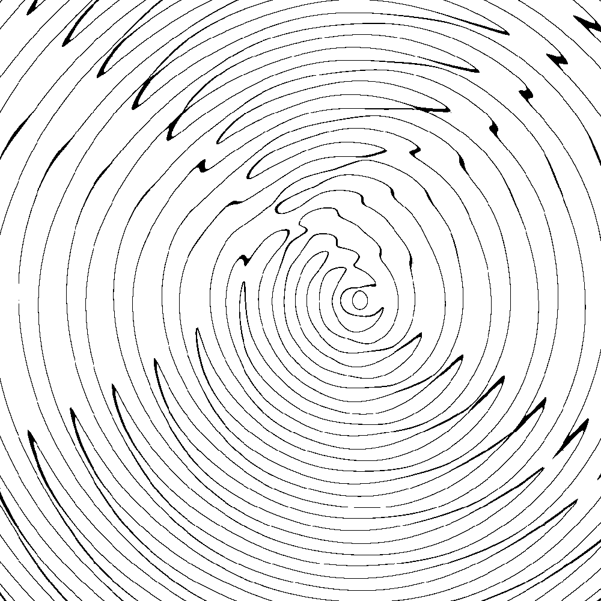

# Interval Arithmetic Function Plotting Demo

$(y-5)\cos(4\sqrt{(x-4)^2+y^2})=x\sin(2\sqrt{x^2+y^2}); x,y\in(-20,20)^2$

$(y-5)\cos(4\sqrt{(x-4)^2+y^2})\ge x\sin(2\sqrt{x^2+y^2}); x,y\in(-20,20)^2$

$\sin(x^2+y^2)=\cos(xy); x,y\in(-20,20)^2$

$\sin(x^2+y^2)\ge\cos(xy); x,y\in(-20,20)^2$

